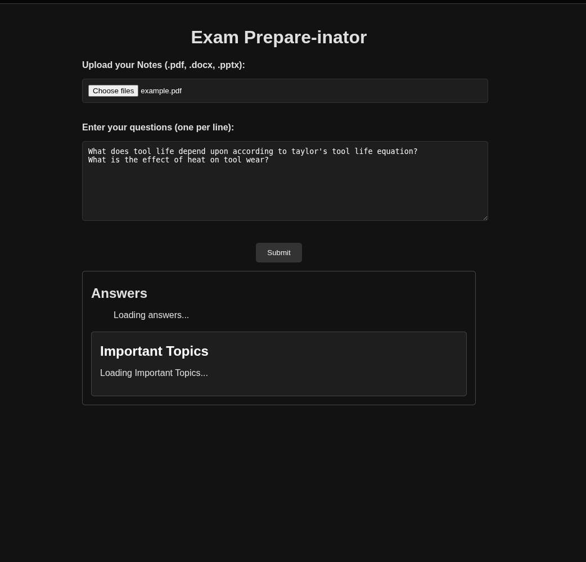
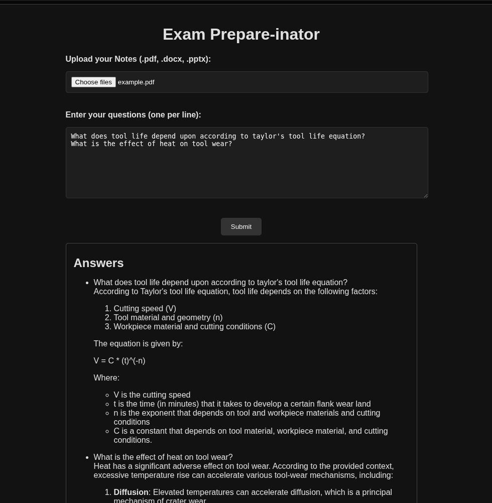
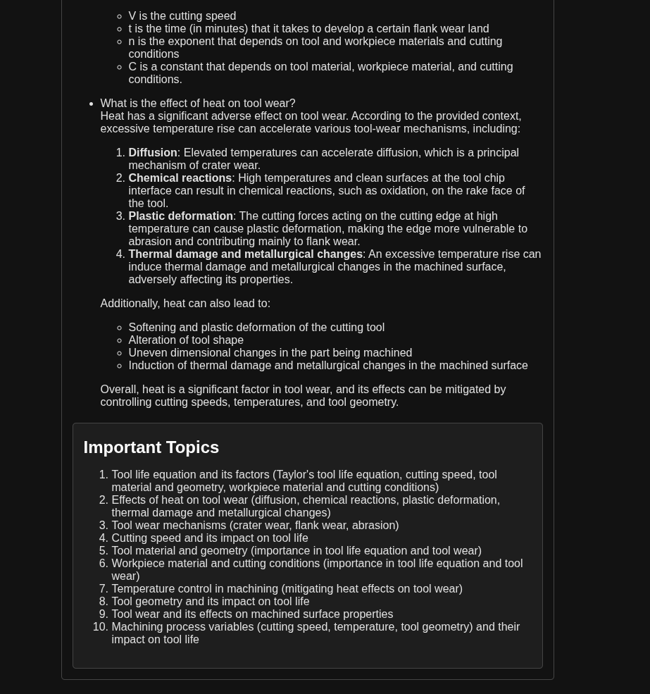

# 🧠 Exam Helper

> A powerful exam preparation assistant that allows students to upload their notes in the form of **PDF**, **DOCX**, or **PPTX** documents, submit multiple previous year questions in a single batch, and receive **context-aware, accurate answers** and a **list of important topics** using Retrieval-Augmented Generation (RAG) with LLMs.


## 🚀 Key Features

- **Multi-Document Upload**: Supports PDF, DOCX, and PPTX formats.
- **Multi-Question Input**: Add multiple previous year questions at once — answers are batch-processed for speed and clarity.
- **RAG Pipeline**: Embeds documents using open-source models (e.g. `bge-base-en`), stores them in a vector store using langgraph's InMemoryStore, and retrieves context based on the questions.
- **LLM Integration**: Uses `Groq` + `llama-3.1-8b-instant` for grounded answer generation while using the context provided by RAG.
- **Important Topics**: Extracts most frequently occuring topics from the answers and displays a concise summary.
- **Automatic Cleanup**: All uploaded files are removed after processing to keep your workspace clean.


## 💻 Technologies Used

- Frontend - HTML, CSS, JS
- Backend - Flask(Python), RAG Pipeline
- LLM Stack - LangChain, Groq, HuggingFace Embeddings


## 📦 File Structure

```bash
rag-project/
├── app.py                      # Flask app entry point
├── .env                        # API key (not tracked by Git)
├── uploads/                    # Temporary upload folder (auto-cleaned)
├── templates/
│   └── index.html              # Frontend HTML
├── static/
│   ├── css/style.css           # Custom dark theme styles
│   └── js/script.js            # AJAX + DOM updates
├── llm_utils/
│   ├── __init__.py
│   └── pipeline.py             # RAG + embedding logic
└── requirements.txt            # Python dependencies
```

## ⚙️ Local Setup Instructions

1. Clone the repository:

```bash
git clone https://github.com/your-username/rag-doc-qa.git
cd rag-doc-qa
```

2. Create a virtual environment and install dependencies:

```bash
python -m venv venv
source venv/bin/activate  # For Windows: venv\Scripts\activate
pip install -r requirements.txt
```

3. Set up your .env file:

```dotenv
GROQ_API_KEY=your_groq_key_here
```

4. Run the app:

```bash
flask run
```

## 📬 Future Enhancements

- Generate important questions based on previous year papers
- Add handwritten notes support with OCR
- Add multi-user session support
- Enable document history and downloads
- Summarization refinement via separate LLM
- Deploy to cloud 

## 📸 Working Images

You can include screenshots using the Markdown image syntax:







